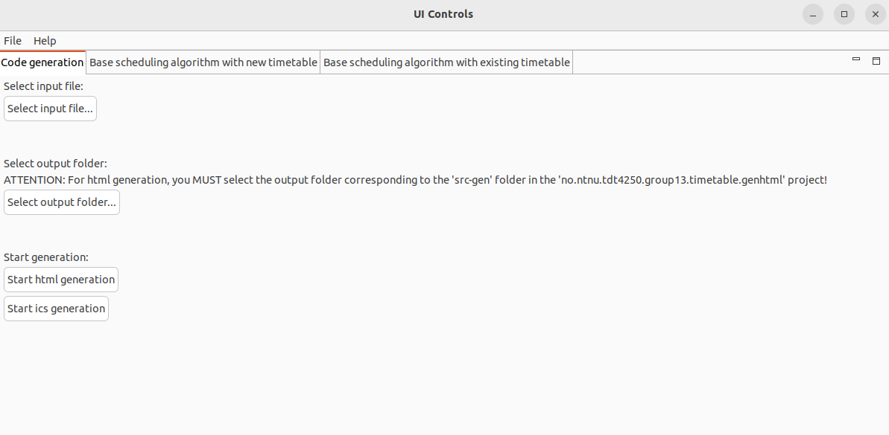
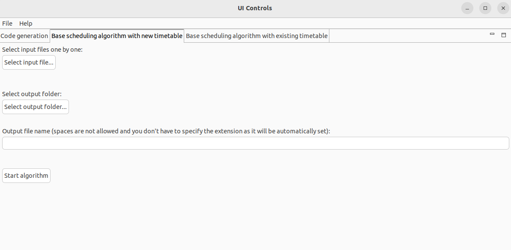
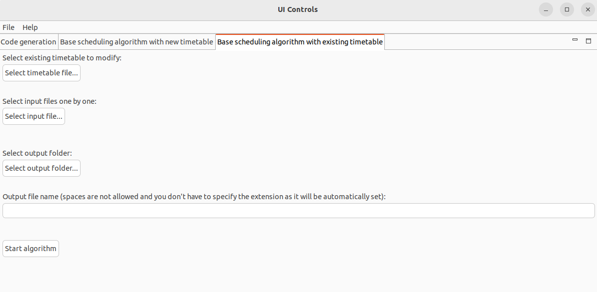

# Advanced Software Design Project – Group 13

## Authors:
 - André Esgalhado - 105186
 - João Fitas - 105980
 - Loïc Savornin - 105038
 - Md. Anwarul Hasan - 583233
 - Rémi Bernard - 105934

## Importing the Project:
We recomend using the eclipse import option and selecting the repository root folder so that you can select all the projects at once and avoid having to import them one by one. Note that apart from the projects inside the osgi folder, all the other projects have dependencies and must all be imported to a same workspace to ensure correct operation. **Concretly all the projects in Scheduling-Algorithm, Scheduling-Requirements and Timetable folders have dependencies and must all be imported to a same workspace.** These folders exist to help with organization within the repository.

The projects in the OSGI-JSON timetable folder seem to not be correctly build on some computers. We still present this part of our work even if it doesn't work at the end, i.e. on the workstation of the correspoding author the program launches but fails to display the JSON structure of the timetable metamodel.

## Components:
### Timetable Metamodel
#### Contributions:
- Rémi Bernard - 90%
- João Fitas - 10%

#### Comments:
The projects corresponding to the Timetable Metamodel component are: 
no.ntnu.tdt4250.group13.timetable 
no.ntnu.tdt4250.group13.timetable.edit 
no.ntnu.tdt4250.group13.timetable.editor

An instance of the metamodel can be found in the main folder of the no.ntnu.tdt4250.group13.timetable project, with the name test.timetable.

### Scheduling Requirements Metamodel
#### Contributions:
- João Fitas - 90%
- Rémi Bernard - 10%

#### Comments:
Two example implementation of this metamodel can be found in the Scheduling_requirements examples. This can be used allong with the existing timetable example on the generator.

### Base Scheduling Algorithm
#### Contributions:
- João Fitas - 100%

#### Use:
This component is incorporated in the UI of the aplication and can be used thru it. 
None the less, this component can also be lauched using an eclipse Run Configuration, acording to the following instructions:
    
    1. Right click the scheduling_algorithm project
    2. From the dropdown list select Run As then Run Configurations
    3. Create a Java Application Run Configuration
    4. Name the run configuration as you wish
    5. Select the arguments Tab
    6. [Optional] For easir file path discovery we recomend changing the working directory to Other and selecting a known folder to use as root for the path in the next step
    7. Fill the Program argumnents according to the following pattern: [--extend Path_to_Existing_Timetable] [Path_to_Each_Requirements]+ Path_to_create_New_Timetable.
    8. Lastly save and run the configuration

#### Arguments clarification:
This component takes as a first optional argument "--extend" followed by the Path to an existing timetable. This should be used if the user wishes to extend an existing timetable.
The last argument is the path where the new timetable should be created
All the arguments in between are the paths to the shechuling requiremnts that should be used to create the new timetable

#### Algorithm Logic
For each Scheduling requirement, the generator, first, combines all rooms and staff to ensure they are compatible, then determines the availabilty for each room and teacher.
With this information, it iterates over each week and attempts to create slots for each requirement, starting with the ones that have more constrains and working its way down. More specificaly, the requirements that require another slot to be placed in the same day are handled first. Then those with teacher and room requirements. Then those with teacher or room requirements. And lastly those with no requirements.
In case incompatibility is detected, an error message is displayed and a new University is requested to the factory and returned to the user.

### Generator Component
#### Contributions:
- Rémi Bernard - 100% (HTML)
- Loïc Savornin - 100% (icalendar)

#### Comments:
The Generator Component is split into two components, which correspond to the following projects: 
no.ntnu.tdt4250.group13.timetable.genhtml 
no.ntnu.tdt4250.group13.timetable.genics

The no.ntnu.tdt4250.group13.timetable.genhtml project produces HTML webpages with the timetable for a course, a group of courses, a specific person, or room.
A configuration called Generate.launch has already been added to the project and should work, but it is still possible to define a customized configuration if needed. **In this case, the output folder MUST be /no.ntnu.tdt4250.group13.timetable.genhtml/src-gen as we use static script (.js) and visualization (.css) files.**
All webpages are generated in the same folder, and the entry point of the website is called NTNU.html. From this page, you can navigate between all the webpages which have been generated.

The no.ntnu.tdt4250.group13.timetable.genics project produces calendars in iCalendar format (.ics) for a course, a person, or a room. 
A configuration called Generateics.launch has already been added to the project and should work, but it is still possible to define a customized configuration if needed.
You can then import one or several generated files in your calendar application.

### Scheduling Requirements Textual Syntax
#### Contributions:
- Rémi Bernard - 100%
- Md Anwarul Hasan - Tried to generate this on a windows PC but things did not generate properly.

#### Comments:
The projects corresponding to the Scheduling Requirements Textual Syntax are: 
no.ntnu.tdt4250.group13.scheduling_requirements.xtext 
no.ntnu.tdt4250.group13.scheduling_requirements.xtext.ide 
no.ntnu.tdt4250.group13.scheduling_requirements.xtext.tests 
no.ntnu.tdt4250.group13.scheduling_requirements.xtext.ui 
no.ntnu.tdt4250.group13.scheduling_requirements.xtext.ui.tests 
no.ntnu.tdt4250.group13.scheduling_requirements.xtext.examples

The five first projects corresponds to the concrete textual syntax and editor for the Scheduling Requirements Metamodel.
The no.ntnu.tdt4250.group13.scheduling_requirements.xtext.examples project contains an example of use of this textual syntax. If you want to create another example, you can launch a runtime application of Eclipse from the workspace where there are all the projects, import the example project, and create a new file in this project with the extension: .srdsl.

### Timetable Graphical Syntax
#### Contributions:
- Rémi Bernard - 100%

#### Comments:
The projects corresponding to the Timetable Graphical Syntax component are: 
no.ntnu.tdt4250.group13.timetable.diagram.editor 
no.ntnu.tdt4250.group13.timetable.examples

The no.ntnu.tdt4250.group13.timetable.diagram.editor projects corresponds to the implementation of the editor.

The no.ntnu.tdt4250.group13.timetable.examples project contains an example of model on which it is possible to use the editor.

### UI Controls
#### Contributions:
- Rémi Bernard - 100%

#### Comments:
The project corresponding the the UI Controls component is:  no.ntnu.tdt4250.group13.timetable.uicontrols

To run the application, it is first necessary to open the no.ntnu.tdt4250.group13.timetable.uicontrols.product file (located in the main folder of the project), and then click on the “Launch an Eclipse application” button. A window corresponding to the application should appear:

On the image above, you can see the three parts of the application:

- The Code generation page enables to launch the two generators (for HTML or for iCalendar files), after having fulfilled the src file and the output folder fields. **For HTML generation, the output folder MUST be /no.ntnu.tdt4250.group13.timetable.genhtml/src-gen as we use static script (.js) and visualization (.css) files.** Then, you can click on the button corresponding to the type of generation you want to launch.

- The Base scheduling algorithm with new timetable page enables to launch the Base Scheduling Algorithm component in the case you entirely create a new timetable. You can import several Scheduling Requirements Metamodel instances (one by one), then choose the output folder and the name of the Timetable Metamodel instance which will be created (spaces are not allowed and you don’t have to specify the extension as it will be automatically set), and finally click on the Start algorithm button:

- The Base scheduling algorithm with existing timetable page enables to launch the Base Scheduling Algorithm component in the case you add new courses to an already existing timetable. You first have to import the Timetable Metamodel instance which will be modified, then the same indications that those for Base scheduling algorithm with new timetable page can be followed:

### JSON Timetable Servlet -> Attempt 1
#### Contributions:
- Md Anwarul Hasan - 100%

#### Note:
There was a first attempt at implementing this component by Md Anwarul Hasan, however it did not fully work, present in the folders "osgi" and "OSGi-JSON timetable".

#### Use:
Inside the "OSGi-JSON timetable" there is "launch.bndrun". To make it work run the "Run OSGi". Before running you can try to resolve the dependencies as well.

Run URL:

http://localhost:8080/data/timetable

### Generated Artifacts Servlets including JSON Timetable Servlet (Attempt 2)
#### Contributions:
- André Esgalhado - 100%

#### Note:
After the initial failed attempt, André Esgalhado tried to implement the JSON Timetable Servlet component and made a functional version in the folder "OSGi-Artifacts Servlets"

#### Use:
For the JSON Timetable Servlet the `.timetable` files should be placed in `final-project-group-13\Timetable\no.ntnu.tdt4250.group13.timetable.examples`.

For the timetables webpages the `.html` files should be generated in `final-project-group-13\Timetable\no.ntnu.tdt4250.group13.timetable.genhtml\src-gen`.

For the iCalendar calendars the `.ics` files should be generated in `final-project-group-13\Timetable\no.ntnu.tdt4250.group13.timetable.genics\src-gen`.

To deploy the microservices the `final-project-group-13\OSGi-Artifacts Servlets` folder should be imported as bnd workspace in eclipse. Then, simply go to launch.bndrun and press the Run OSGi button.

Another way to run is to run the packaged jar file. To do this, after packaging, make sure you are in `final-project-group-13\OSGi-Artifacts Servlets\artifacts_servlets`. Then run `java -jar launch.jar`. Make sure that `launch.jar` has been exported previously and is in that location. If gradle was used to package, the jar should be in `final-project-group-13\OSGi-Artifacts Servlets\artifacts_servlets\generated\distributions\executable\`. For instructions on how to package and deploy refer to the Packaging and Deployment section.

After the server is started, access the desired URI. For example, http://localhost:8080/timetable/model.xmi/Artificial%20Intelligence, corresponds to the `Artificial Intelligence.html` timetable webpage.

#### Some examples:

JSON Timetable Servlet: http://localhost:8080/data/model.xmi/test

University Timetable: http://localhost:8080/timetable/model.xmi/courses

Course Timetable: http://localhost:8080/timetable/model.xmi/Artificial%20Intelligence

Professor Timetable: http://localhost:8080/timetable/model.xmi/Alex

Course iCalendar: http://localhost:8080/icalendar/model.xmi/Artificial%20Intelligence

### Packaging and Deployment
#### Contributions:
- André Esgalhado
- João Fitas
- Rémi Bernard

The packaging for the core concepts: Timetable and Scheduling Requirements is done using maven and can be found inside the respective folders.

The projects corresponding to the packaging and deployement for the Desktop system can be found in the Timetable folder and are named:
no.ntnu.tdt4250.group13.feature 
no.ntnu.tdt4250.group13.repository

The microservices components are fully packaged and deployed automatically with `gradle`. To do this you can run the wrapper with ./gradlew (make sure that the file is set as executable). Then, use `./gradlew export` to export all OSGi launch configurations, in an executable JAR file. The output file will be located at `final-project-group-13\OSGi-Artifacts Servlets\artifacts_servlets\generated\distributions\executable\`. Once executed, the servlet can be reached and everything should work.

